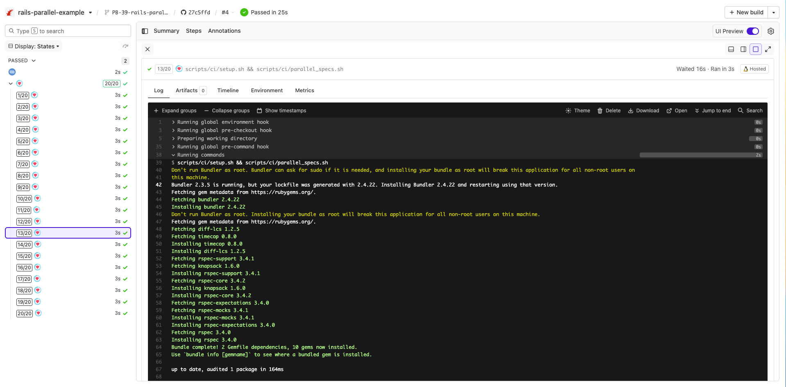

# Buildkite Rails Parallel Pipeline Example

[](https://buildkite.com/buildkite/rails-parallel-example/builds/latest?branch=main)
[](https://buildkite.com/new)

This repository is an example [Buildkite](https://buildkite.com/) pipeline that demonstrates how to run 20 parallel test jobs for a [Rails](https://rubyonrails.org/) application using [rbenv](https://github.com/rbenv/rbenv) and [Knapsack](https://github.com/ArturT/knapsack).

👉 **See this example in action:** [buildkite/rails-parallel-example](https://buildkite.com/buildkite/rails-parallel-example/builds/latest?branch=main)

[](https://buildkite.com/new)

<a href="https://buildkite.com/buildkite/rails-parallel-example/builds/latest?branch=main">
  
</a>

<!-- docs:start -->

## How it works

This repository doesn't include a Rails application, but it does provide the CI setup you'd typically use in a real project.

In the [pipeline configuration file](.buildkite/pipeline.yml) the `parallelism` property for the test step is set to 20. When a build, the step will appear 20 times in the pipeline, each with different environment variables exposed so you can divvy up your test suite accordingly. You can then run 20 agents (on the same machine, or distributed) to work on the 20 jobs in parallel.

This example:
- Uses rbenv to manage Ruby versions
- Runs tests in parallel using Buildkite’s `parallelism` feature
- Leverages [Knapsack](https://github.com/ArturT/knapsack) for test suite splitting
- Can be used on a single machine or distributed across multiple agents

Key files:
- [.buildkite/hooks/environment](.buildkite/hooks/environment): loads rbenv before steps run
- [.buildkite/pipeline.yml](.buildkite/pipeline.yml): sets up parallel steps
- [scripts/ci/setup.sh](scripts/ci/setup.sh): prepares the CI environment
- [scripts/ci/parallel_specs.sh](scripts/ci/parallel_specs.sh): runs specs via Knapsack

### Parallel test execution

The test step in [`pipeline.yml`](.buildkite/pipeline.yml) is configured like this:

```yml
steps:
  - name: ":rspec:"
    command: "scripts/ci/setup.sh && scripts/ci/parallel_specs.sh"
    parallelism: 20
```

Each parallel job receives unique environment variables (`BUILDKITE_PARALLEL_JOB`, `BUILDKITE_PARALLEL_JOB_COUNT`) to help split the workload.

See the [parallelizing builds guide](https://buildkite.com/docs/guides/parallelizing-builds) for more information to create parallelized and distributed builds with Buildkite.

> 💡 Want to use Docker? Try the [Rails Docker Parallel Example](https://github.com/buildkite/rails-docker-parallel-example)

## Knapsack Pro

Consult the [Knapsack documentation](https://github.com/ArturT/knapsack) for configuring your database and dependent services to support running parallel steps on the one machine.

See [Knapsack Pro version of this example pipeline](https://github.com/KnapsackPro/buildkite-rails-parallel-example-with-knapsack_pro) for how to perform dynamic splits/allocation of test nodes.

## License

See [LICENSE.md](LICENSE.md) (MIT)


