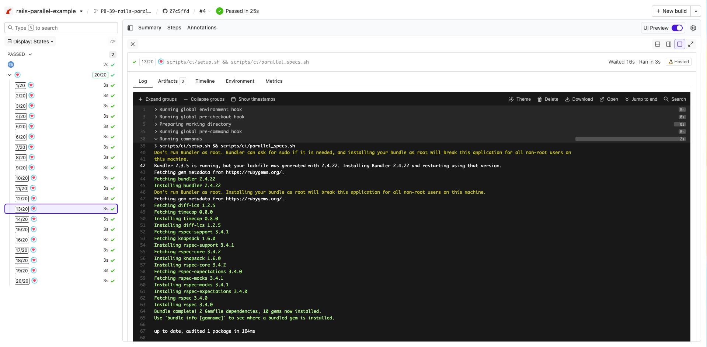

# Buildkite Rails Parallel Pipeline Example

[](https://buildkite.com/buildkite/rails-parallel-example)
[](https://buildkite.com/new)

This repository is an example on how to easily run 20 parallel testing agents for a [Rails](https://rubyonrails.org/) application using [Buildkite](https://buildkite.com/), [rbenv](https://github.com/rbenv/rbenv) and [Knapsack](https://github.com/ArturT/knapsack).

See the full [Getting Started Guide](https://buildkite.com/docs/guides/getting-started) for step-by-step instructions on how to get this running, or [Add to Buildkite](https://buildkite.com/new) to try it yourself.

<a href="https://buildkite.com/buildkite/rails-parallel-example/builds?branch=main"></a>

This repository doesn't actually include a Rails sample application, but has the same CI scripts you would use for a production application.

Files to note:

* [.buildkite/hooks/environment](.buildkite/hooks/environment) - loads rbenv
* [.buildkite/pipeline.yml](.buildkite/pipeline.yml) - the pipeline config showing how to have parallel steps
* [scripts/ci/setup.sh](scripts/ci/setup.sh) - sets up the CI environment for each step
* [scripts/ci/parallel_specs.sh](scripts/ci/parallel_specs.sh) - runs the specs in parallel using Knapsack

## How does it work?

In the [pipeline configuration file](.buildkite/pipeline.yml) the `parallelism` property for the test step is set to 20. When a build, the step will appear 20 times in the pipeline, each with different environment variables exposed so you can divvy up your test suite accordingly. You can then run 20 agents (on the same machine, or distributed) to work on the 20 jobs in parallel.

```yml
steps:
  - name: ":rspec:"
    command: "scripts/ci/setup.sh && scripts/ci/parallel_specs.sh"
    parallelism: 20
```

See the [parallelizing builds guide](https://buildkite.com/docs/guides/parallelizing-builds) for more information to create parallelized and distributed builds with Buildkite.

Consult the [Knapsack documentation](https://github.com/ArturT/knapsack) for configuring your database and dependent services to support running parallel steps on the one machine.

## Knapsack Pro

See [Knapsack Pro version of this example pipeline](https://github.com/KnapsackPro/buildkite-rails-parallel-example-with-knapsack_pro) for how to perform dynamic splits/allocation of test nodes.

## License

See [Licence.md](Licence.md) (MIT)
